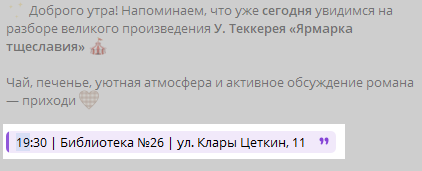
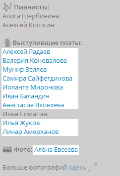

Этот стайлгайд посвящён тому, как вести наш [телеграм-канал КОМП](https://t.me/komppoet).

**Содержание:**

- [Структура постов](#структура-постов) – из каких кирпичиков строится каждый пост.
- [Рубрики](#рубрики) – какие типы постов у нас есть, шаблоны постов под каждую рубрику.
- [Тон голоса бренда](#тон-голоса-бренда) – что такое тон голоса для бренда и как соблюдать его при написании постов.
- [Оформление постов](#оформление-постов) – как отредактировать текст, добавить вложения и расставить эмодзи.
- [Проверка текста](#проверка-текста) – как убедиться, что в тексте нет ошибок.
- [Работа в команде](#работа-в-команде) – как взаимодействовать с другими редакторами и SMM-щиками при написании постов.

Рекомендуем изучать разделы в том порядке, в каком они указаны в содержании.

По поводу правок и предложений писать **[Имя автора]** (tg: @username).

## Структура постов {#структура-постов}

Посты в канале имеют общую структуру – каждый пост можно условно разделить на следующие секции:

Главные секции – **приветствие**, **основная часть** и **подпись**. **Контекст** и **детали** добавляются, если они нужны по смыслу.

### Приветствие {#приветствие}

Мы начинаем все сообщения с приветствия. Так мы создаём вежливую и дружелюбную атмосферу. Независимо от [рубрики поста](#рубрики), в начале всегда должно быть приветствие.

Приветствие состоит из двух частей – сначала здороваемся с читателем, после сообщаем, какой новостью хотим поделиться.

Здороваемся с подписчиками как с друзьями – тепло и без лишней фамильярности, но при этом вежливо. Например:

- Более формальный вариант:
  - Друзья!
  - Дорогие друзья!
- Менее формальный:
  - Дорогие друзья, поэты и мечтатели, творческий привет!

Далее рассказываем, с какой целью мы обратились к аудитории. В результате получится такое приветствие:

- Дорогие друзья! Приглашаем вас на следующее мероприятие цикла «Ок, ставим библиотеку на КОМП»
- Дорогие друзья, всем спортивный привет! В эту пятницу в Казани стартует наш марафон «Бег» — место, где слово и звук сливаются в едином ритме!

### Контекст {#контекст}

Надо давать читателю контекст. Это помогает ему понять суть поста. Например, контекст используется, чтобы:

- Рассказать о сути предстоящего мероприятия:
  - Идея мероприятия: разговор участников об авторе и его книге в непринужденной обстановке. Ознакомление при помощи модератора со стилистической и филологической составляющей, раскрытие актуальности.
  - КОМП.WORD — любительский поэтический кружок для авторов, только начинающих свой путь в стихосложении, и для тех, кто хочет повысить уровень и качество своих текстов, попрактиковаться в правильной подаче при чтении стихотворений и просто интересно и продуктивно провести время в компании творческих людей.
- Кратко пересказать программу прошедшего мероприятия:
  - 11 октября в чайной лавке «Дао» прошёл увлекательный вечер: мы собирались прочесть стихи китайских авторов в переводе на русский и выпить настоящего китайского чая в ходе традиционной чайной церемонии.

### Основная часть {#основная-часть}

Посвятив читателя в курс дела и достаточно заинтересовав его, мы переходим к главной информации – сообщить, где, когда и как будет проводиться мероприятие или же рассказать о том, как оно прошло, а может быть даже поделиться важной новостью нашего сообщества.

Наполнение этой части полностью зависит от [рубрики поста](#рубрики).

### Детали {#детали}

Что делать, если [контекст](#контекст) и основная часть получились слишком затянутыми, а важное пояснение нужно куда-то добавить? В этом случае на помощь приходит раздел Детали, который вбирает в себя все примечания. Такими примечаниями могут быть:

- Уточнения об особенностях мероприятия (платный вход, ограниченное кол-во мест, как записаться на выступление и т.д.):
  - Вход: Free donation;
  - Обращаем ваше внимание, что количество мест ограничено!;
  - Для записи на выступление: [Имя организатора] — ...
- Сведения от организаторов мероприятий, владельцев площадок:
  - Журнал «Татарстан» в соцсетях: [ссылка на сайт] [ссылка на VK] [ссылка на Telegram] [ссылка на VK]

### Подпись {#подпись}

В конце поста надо оставлять подпись. Такая подпись нужна для прощания с читателем. Но прощанием не навсегда – мы рады видеть наших читателей снова и снова:

- Классический вариант:
  - До встречи :) С любовью, команда «КОМПа»
- Более формальный:
  - Будем рады тем, кто подключится к активному обсуждению и тем, кто придёт просто послушать
- Менее формальный:
  - Спасибо всеееем! ❤ До встречи на новых мероприятиях :) С любовью, команда «КОМПа» ♥

## Рубрики {#рубрики}

Мы проводим много разных мероприятий – поэтические вечера, квартирники, походы, и даже занятия спортом! Такое же разнообразие есть и в рубриках нашего канала. Все мероприятия можно разделить по их регулярности: какие-то повторяются, какие-то нет.

Чтобы создать информативный пост с анонсом мероприятия, нужно понимать его особенности – как регулярно оно проводится, кем и где, что нужно знать читателю о мероприятии перед его началом.

Также нужно знать, кто занимается афишами и организацией мероприятий – полный список членов отдела SMM находится в разделе [Состав отдела SMM](#состав-отдела-smm).

### Регулярные {#регулярные}

#### Поэтический кружок «КОМП.WORD» {#комп-word}

«КОМП.WORD» – любительский поэтический кружок для авторов, который проводит **[Имя организатора]** (tg: @username).

Время и место проведения не отличаются, поэтому в текст анонса необходимо обновить только дату и афишу. Пост для этой рубрики пишется так:

1. Заранее копируем текст из любого аналогичного поста в качестве шаблона. Обращаем внимание, что без премиума в Telegram премиумные эмодзи превратятся в обычные.
2. Просим актуальную афишу у дизайнера этой рубрики – **[Имя дизайнера]** (tg: @username) и прикрепляем к посту.
3. Заменяем дату на актуальную.

#### Обсуждение книг «Ок, ставим библиотеку на КОМП» {#ок-ставим-библиотеку-на-комп}

«Ок, ставим библиотеку на КОМП» – книжный клуб, на котором участники обсуждают библиографию писателя и его книги в непринуждённой обстановке. Проводится **[Имя организатора]** (tg: @username). Организатор даёт черновик текста, который нужно отредактировать. Пост для этой рубрики пишется так:

1. Заранее копируем текст из любого аналогичного поста в качестве шаблона. Обращаем внимание, что без премиума в Telegram премиумные эмодзи превратятся в обычные.
2. Просим актуальную афишу у дизайнера этой рубрики – **[Имя дизайнера]** (tg: @username) и прикрепляем к посту.
3. Заменяем описание книги ту, которая будет обсуждаться на этой неделе.
4. Заменяем темы для обсуждения, если в варианте, предложенным организатором, они отличаются.
5. Заменяем дату на актуальную.
6. Обновляем список книг для обсуждения на следующей встрече: удаляем уже обсуждённые книги и добавляем новые по необходимости.

#### Дни рождения

Мы не забываем тепло поздравлять участников нашего объединения – публикуем поздравительный пост в канале в день их рождения. Список дней рождений находится в **[Имя таблицы]**. Поздравления пишем так:

1. Выбираем фото именинника. Можно спросить у самого именинника, какое фото он хочет видеть в поздравительном посте. Фото загружаем из файла, чтобы не потерять качество изображения.
2. Пишем [приветствие](#приветствие) – рассказываем, кого поздравляем и какую роль выполняет именинник в нашей команде.
3. Пишем [контекст](#контекст) – вступление перед списком пожеланий на день рождения.
4. Пишем [основную часть](#основная-часть) – пожелания на праздник в формате списка.

   **Важно!** Не пишем, что человек делает что-то (пишет стихи, поёт) лучше всех, дабы никого не сравнивать – все уникальны по-своему!

5. Добавляем [подпись](#подпись) – просим аудиторию присоединиться к поздравительному в комментариях. Также в подписи добавляем фирменную фразу «С любовью...».

### Нерегулярные

#### Анонсы мероприятий {#анонсы-мероприятий}

Мероприятия имеют разную тематику, но все анонсы мероприятий имеют схожую структуру. Пост с анонсом мероприятия пишется по единому шаблону:

1. Просим афишу у дизайнера.
2. Пишем [приветствие](#приветствие).
3. Добавляем [контекст](#контекст) мероприятия, если это необходимо.
4. Пишем [основную часть](#основная-часть). Она содержит:
   - список активностей мероприятия в виде списка, где элемент списка кратко описывает активность;
   - дату;
   - время;
   - место;
   - количество свободных мест для участников и зрителей, если это необходимо.
5. Добавляем [детали](#детали). В данном случае это:
   - информация об организаторах, добавленная по их просьбе;
   - ссылка на форму для записи участников.
6. Добавляем [подпись](#подпись).

#### Напоминания о предстоящих мероприятиях {#напоминания}

[Анонсы мероприятий](#анонсы-мероприятий) выкладывается за несколько дней или недель до начала мероприятия. Поэтому важно напомнить читателям о приближающихся событиях.

Напоминание можно написать двумя способами. Первый – напомнить об одном конкретном мероприятии. Для этого отвечаем на пост с анонсом мероприятия:

1. Пишем [приветствие](#приветствие) – указываем, о каком мероприятии идёт речь.
2. Пишем [основную часть](#основная-часть) – подробности о проведении мероприятия, дату, место и т.д.
3. Добавляем [подпись](#подпись).

Второй способ используется, когда надо одновременно напомнить о нескольких мероприятиях. В таких случаях пригодится подобная структура:

1. Создаём коллаж из всех афиш в любом подходящем редакторе.
2. Вместо [приветствия](#приветствие) можно использовать [эмодзи](#эмодзи) в виде букв, чтобы сделать пост более лаконичным.
3. Пишем [основную часть](#основная-часть) – список мероприятий, где каждый элемент списка это:
   - дата мероприятия;
   - ссылка на пост с анонсом и название мероприятия;
   - время, дата и место проведения мероприятия.
4. Добавляем [подпись](#подпись).

#### Рассказы о прошедших мероприятиях {#рассказы-о-прошедших-мероприятиях}

Мы делимся с читателями впечатлениями об уже прошедших событиях – ведь кому-то обязательно захочется увидеть красочные фото от наших фотографов или пережить эмоции от события ещё раз.

В таких рассказах мы делаем упор на пережитые чувства и эмоции, но при этом соблюдаем структуру постов:

1. Создаём коллаж из самых удачных фотографий от наших фотографов. Ссылку на архив с фотографиями просим у **[Имя фотографа]** (tg: @username).
2. Вместо [приветствия](#приветствие) можно использовать [эмодзи](#эмодзи) в виде букв, чтобы сделать пост более лаконичным.
3. Добавляем [контекст](#контекст) мероприятия – что это за мероприятие и когда оно проходило.
4. Пишем [основную часть](#основная-часть) – подробности о проведении мероприятия, дату, место и т.д.
5. Пишем [детали](#детали) – указываем всех лиц, участвующих в проведении мероприятия:
   - выступающих – поэтов, музыкантов и т.д.
   - диджеев;
   - фотографов;
   - ведущих;
   - канал площадки, на котором проводилось мероприятие.

   Вместо ссылок на страницы участников оставляем ссылки на их каналы. Ссылки добавляем только если сами участники дают на это разрешение.

   Также оставляем ссылку на архив с фото при его наличии.

6. Добавляем [подпись](#подпись).

#### Объявления

Иногда требуется сделать объявление в канале, которое не соответствует шаблонам вышеперечисленных рубрик. Например, провести розыгрыш призов, попросить подписчиков «забустить» канал для открытия нового функционала и т.д.

Для таких случаев нет предписанной структуры – пишем в свободной форме, соблюдая три обязательных раздела:

1. [Приветствие](#приветствие)
2. [Основная часть](#основная-часть)
3. [Подпись](#подпись)

## «Тон голоса» бренда {#тон-голоса-бренда}

Определение из интернета:

«_Tone of voice (ToV), или «тон голоса» бренда, — это его уникальный стиль общения с аудиторией: как он говорит (на «ты»/«вы», с юмором или серьезно, использует ли сленг), что отражает его ценности, характер и формирует узнаваемость и доверие, как личность, чтобы люди ассоциировали себя с ним._»

Наше сообщество также имеет уникальный стиль, которого мы придерживаемся при написании постов. Недостаточно только написать текст по шаблону для конкретной [рубрики](#рубрики) – надо соблюдать «тон голоса», которым мы говорим с читателями.

Наш голос звучит как друг, который вдохновляет, а не поучает. Такой друг обладает подобными чертами характера:

1. **Искренний и человечный:**
   - Избегает официоза и канцелярита.
   - Говорит как с живым человеком, а не с аудиторией.
   - Допускает эмоциональные окраски: восхищение, поддержка, лёгкая ирония.

2. **Современный, но не сленговый:**
   - Используем актуальный язык молодежи.
   - Избегаем устаревших или чрезмерно интернетных выражений.
   - Допустимы умеренные эмоциональные усилители: «невероятно», «особенный», «уникальный».

В качестве примера взглянем на формулировки:

✅ Вместо: «Приглашаем вас на мероприятие»  
🔹 Пишем: «Ждём именно тебя на нашей встрече!»

✅ Вместо: «Будет представлена программа»  
🔹 Пишем: «Тебя ждёт...», «Мы приготовили...»

✅ Вместо: «Участники прочтут стихи»  
🔹 Пишем: «Прозвучат стихи», «Слова оживут»

Чтобы общаться с аудиторией в стиле нашего Tone of Voice, мы используем следующие приёмы:

- Используем живые метафоры («зажечь звёзды», «слова оживают»).
- Добавляем лёгкую игривость (эмодзи, но дозированно).
- Сохраняем ритм и динамику (короткие абзацы, энергичные фразы).
- Включаем элементы интриги («секреты», «особенный вечер», «уникальный шанс»).

## Оформление постов {#оформление-постов}

Мы написали пост для выбранной [рубрики](#рубрики) с учётом [структуры поста](#структура-постов). Теперь надо превратить этот текст в полноценный пост – добавить к нему [вложения](#вложения) и [отформатировать](#форматирование-текста), а также расставить [эмодзи](#эмодзи).

### Вложения {#вложения}

Вложения могут быть видео или изображения.

Видео занимается **[Имя видео-мейкера]** (tg: @username). К ней можно обратиться для монтажа клипа, если тот нужен для анонса, рассказа о прошедшем мероприятии или любой другой рубрики.

В качестве изображений могут выступать:

- Афиши для [анонсов мероприятий](#анонсы-мероприятий). Список дизайнеров, у которых можно попросить афишу, находится в разделе Состав отдела SMM.
- Фотографии для [рассказов о прошедших мероприятиях](#рассказы-о-прошедших-мероприятиях). Список фотографов, у которых можно попросить ссылку на архив с фотографиями, находится в разделе [Состав отдела SMM](#состав-отдела-smm).

Для рассказов о мероприятиях выбираем фотографии для поста по следующим критериям:

- По возможности добавляем в подборку минимум 5 фотографий, чтобы их можно было удобно сгруппировать в коллаж.
- Выбираем только качественные фотографии – на них не должно быть засветов, закрытых глаз, нелепых поз и т.д.
- Подбираем фотографии так, чтобы на них было изображено как можно больше разных участников мероприятия – избегайте подборок, где на разных фото изображены одни и те же люди.
- При группировке фотографий в коллаже учитываем их вертикальную или горизонтальную ориентацию. Не должно получиться так, чтобы фотография в посте выглядела слишком мелкой.

### Форматирование текста {#форматирование-текста}

Форматирование текста заключается в изменении шрифтов, добавлении [ссылок](#ссылки) и [хештегов](#хештеги). При форматировании важно не переборщить – избыточное разнообразие портит текст так же, как и его недостаток.

Наш канал имеет собственные правила форматирования:

#### Жирный шрифт

Жирным шрифтом выделяются:

- Названия мероприятий

  
  
- Названия произведений

  

- Имена, занимаемые должности, организации

  

- Пункты программы мероприятия в [основной части](#основная-часть), если нужно сделать акцент на отдельных словах или фразах

  

- Слова «Дата», «Время», «Место» и другие сведения о мероприятии в [основной части](#основная-часть)

  

#### Курсивный шрифт

Курсивом выделяются:

- Текст внутри цитаты, которая находится в разделе [Детали](#детали)

  

- Раздел [Подпись](#подпись)

  

#### Цитаты

Цитаты используются, когда надо:

- скрыть длинное пояснение. В таких случаях публикуем цитату «свёрнутой»

  

- написать [напоминание](#напоминания) и выделить в нём краткую информации о мероприятии

  

- выделить в разделе [Детали](#детали) блок информации

  

#### Ссылки {#ссылки}

Мы добавляем ссылки на следующие источники:

- участников мероприятия (поэтов, музыкантов, диджеев, фотографов и т.д.). Добавляем ссылку на личный канал человека, но только если он разрешил

  

- архивы с фотографиями с мероприятий

  

- площадки, на которых проводились мероприятия

  

- карты с указыванием места, где будет проводиться мероприятие

  

- формы для регистрации, покупки билетов

  

- контакты организаторов

  

#### Хештеги {#хештеги}

Хештеги всегда ставятся в самый конец поста:

Они используются только для [регулярных рубрик](#регулярные):

- [«КОМП.Word»](#комп-word) – #КОМПword
- [«Ок, ставим библиотеку на КОМП»](#ок-ставим-библиотеку-на-комп) – #ОкставимбиблиотекунаКоМп

### Эмодзи {#эмодзи}

Мы используем премиумные эмодзи, чтобы разнообразить визуал поста. Все используемые наборы эмодзи собраны **[Ссылка на сообщение]**.

Эмодзи используются в:

- заголовках в виде эмодзи-букв, которыми для краткости можно заменять [приветствия](#приветствие)

  

  

- маркерах списков

  
  
- абзацных отступах

  

При использовании эмодзи стоит помнить следующие правила:

- Используем эмодзи в меру – в одном предложении один эмодзи.
- Расставляем эмодзи по смыслу. Они должны передавать смысл пункта списка или абзаца. Например, если в предложении описывается книга для прочтения, то логичнее будет поставить эмодзи книги; если речь идёт о дате, то подойдёт эмодзи календаря или часов и т.д. Отходить от данного правила можно, если под описание нет подходящего по смыслу эмодзи.
- Желательно, чтобы эмодзи сочетались по цвету с [вложениями](#вложения), прикреплёнными к посту.

## Проверка текста {#проверка-текста}

### Чек-лист для самопроверки {#чек-лист}

После того, как мы написали текст, мы самостоятельно его проверяем. Советуем перед проверкой отложить текст в сторону на пару минут, чтобы после оценить его свежим взглядом. Проверяем по следующим пунктам:

- В тексте соблюдена [структура](#структура-постов)
- Текст написан по правилам выбранной [рубрики](#рубрики)
- Текст оформлен согласно правилам:
  - Во [вложениях](#вложения) (фото или видео) нет ошибок в тексте, при выборе фотографий соблюдены все [критерии](#вложения)
  - Жирный и курсивный текст, цитаты, ссылки и хештеги используются согласно [правилам](#форматирование-текста)
  - Эмодзи расставлены согласно [правилам](#эмодзи)
- В тексте соблюдён [«тон голоса» бренда](#тон-голоса-бренда)
- Текст [проверен на ошибки]((#чек-лист)), все найденные ошибки исправлены

### Полезные сервисы для проверки

Для проверки текста мы пользуемся следующими сайтами:

- [TEXT.RU](http://TEXT.RU) – сервис для проверки текста. Мы используем раздел сайта [Проверка орфографии и пунктуации](https://text.ru/spelling), чтобы исключить случайные ошибки, пропущенные при [самопроверке](#чек-лист).
- [«Грамота.ру»](https://gramota.ru/) – портал о русском языке. Мы обращаемся к нему, чтобы найти ответы на неоднозначные вопросы, связанные с орфографией, пунктуацией и т.д.

## Работа в команде {#работа-в-команде}

Редакторы работают в команде. Помимо общения внутри команды, они взаимодействуют с другими SMM-щиками – видео-мейкерами, дизайнерами и т.д.

### Состав отдела SMM {#состав-отдела-smm}

Отдел редакторов находится в составе отдела SMM. У отдела SMM есть свой чат Комитет SMM КОМП **[Ссылка на чат]**, который предназначен для обсуждения соответствующей работы. Например, какое мероприятие анонсировать, когда напомнить о грядущем мероприятии и т.д.

Схема содержит все отделы внутри SMM и их иерархию:

**Схема**

### Перекрёстная проверка

Помимо самостоятельной проверки текста, мы проводим перекрёстную – просим других редакторов проверить вашу работу. Это помогает найти ошибки, которые мы не заметили самостоятельно. Алгоритм действий такой:

1. Тегаем в чате SMM двух редакторов и просим проверить текст по [чек-листу](#чек-лист).
2. Другие редакторы проверяют ваш текст. Если он их не устраивает, то отправляют его обратно вам с комментариями для доработки.
3. Процедура повторяется, пока обоих проверяющих не устроит конечный результат.

Только после одобрения от других редакторов текст можно будет публиковать.

### Дежурство

Каждую неделю в воскресенье назначается следующий дежурный редактор. В обязанности дежурного редактора входит:

- Заранее распределить между редакторами написание постов для [регулярных](#регулярные) и [нерегулярных](#нерегулярные) рубрик. Чтобы контролировать выполнение этих задач, мы составляем список по [шаблону](#ведение-списка-задач).
- Распределять задачи на публикацию внеплановых постов. Например, рекламных постов.
- Быть на связи и контролировать прогресс выполнения задач – вычёркивать выполненные пункты.
- Передавать оставшуюся часть работы следующему дежурному.

Такая система позволяет равномерно распределять работу между всеми редакторами, а также оперативно реагировать на новые задачи.

#### Ведение списка задач {#ведение-списка-задач}

Для ведения списка задач мы используем следующий шаблон:

_[Дата начала дежурства] – [Дата окончания дежурства]  
Дежурный [Алиас в тг]  
[Алиас редактора #1]:_

_1. [Описание задачи #1]. [Дедлайн задачи #1]  
2. [Описание задачи #2]. [Дедлайн задачи #2]  
...  
[Алиас редактора #2]:  
..._

Дежурный закрепляет сообщение со списком в чате SMM до окончания своего дежурства.

#### Порядок дежурства

Каждый из редакторов дежурит по очереди. Если в свою очередь дежурить не получается из-за обстоятельств, заранее об этом уведомляем. Порядок дежурств (повторяется по кругу):

1. [Имя редактора #1]
2. [Имя редактора #2]
3. [Имя редактора #3]
4. [Имя редактора #4]
5. [Имя редактора #5]
